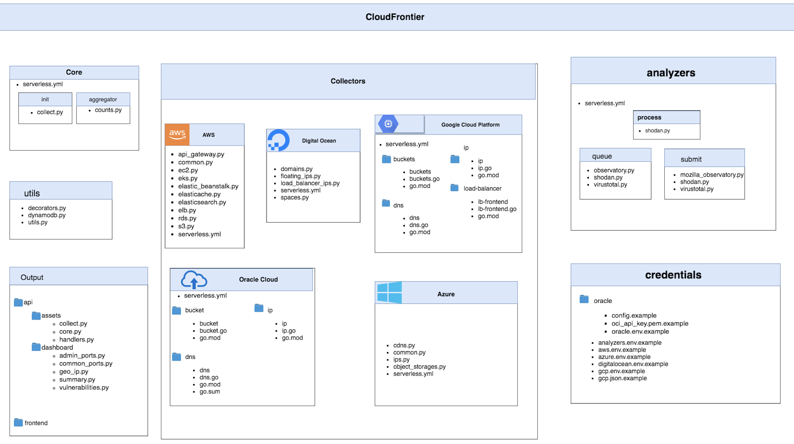
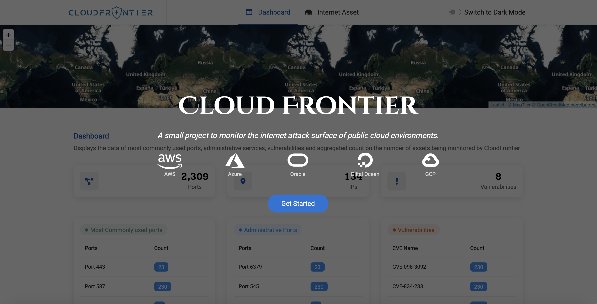
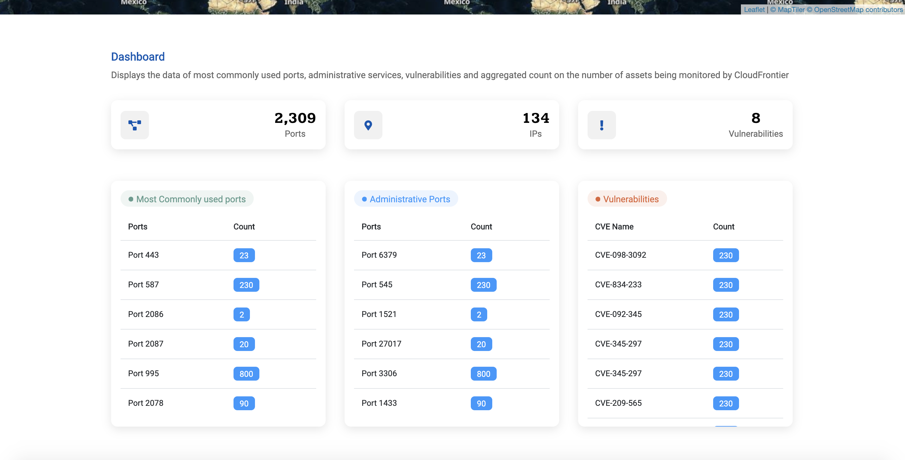
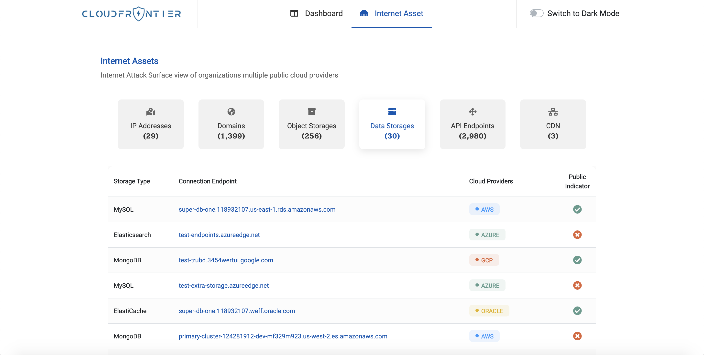
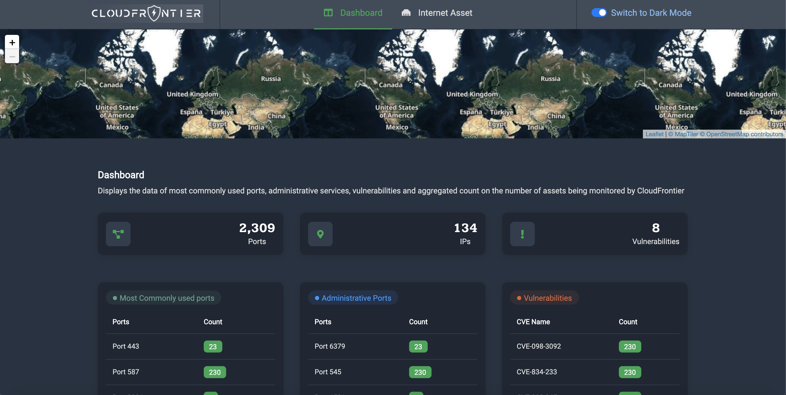

> Monitor the internet attack surface of various public cloud environments.

Currently supports AWS, GCP, Azure, DigitalOcean and Oracle Cloud.

### Contents

* [Setting up](#%EF%B8%8F-setting-up)
  * [Cloud accounts](#cloud-accounts)
  * [Analyzer services](#analyzer-services)
  * [Deployment dependencies](#deployment-dependencies)
* [Deployment](#-deployment)
  * [Using a local environment](#using-a-local-environment-1)
  * [Using Docker](#using-docker-1)
* [Supported resources and services](#-supported-resources-and-services)
  * [AWS](#aws-1)
  * [GCP](#gcp-1)
  * [Azure](#azure-1)
  * [DigitalOcean](#digitalocean-1)
  * [Oracle Cloud](#oracle-cloud-1)
* [Components](#-components)
* [Screenshots](#-screenshots)
* [Roadmap](#%EF%B8%8F-roadmap)
* [Contributors](#-contributors)
* [Contributing](#-contributing)
* [License](#%EF%B8%8F-license)

# ⚙️ Setting up

The project is built using multiple serverless services which are to be deployed
to AWS using the [Serverless framework](https://github.com/serverless/serverless).
For this, you'll need to configure the credentials of the AWS account to which
you want to deploy to.

Once you've done that, you can start setting up the cloud accounts you want to
scan.

## Cloud accounts

Templates for the credentials are available in the `credentials` directory and
have the suffix `.example`. To create the actual environment/credential file,
you can simply create a copy of the template and remove `.example` from its name.

### AWS

<details>
  <summary>View instructions</summary>
  <br>

  Upload the CloudFormation template `CloudFrontierAWS.yml` to the account whose
  assets you want to collect. The output of this stack will be an IAM role's ARN
  that Cloud Frontier will use to collect the assets. Copy the ARN and paste it
  in `credentials/aws.env`.

</details>

### GCP

<details>
  <summary>View instructions</summary>
  <br>

  To collect assets from your GCP account, you'll need to
  [create a service account key](https://cloud.google.com/iam/docs/creating-managing-service-account-keys).

  Once you've created the key, add it to `credentials/gcp.json`, and also add
  the GCP project ID to `credentials/gcp.env`.

</details>

### Azure

<details>
  <summary>View instructions</summary>
  <br>

  Obtain or generate the following IDs and secrets from your Azure account and
  add them to `credentials/azure.env`.

  * **Create application in Azure Active Directory**
    1. Select Azure Active directory in the left sidebar
    1. Click on App registrations
    1. Click on Add
    1. Enter the application name, select application type (web app/api) and sign-on URL
    1. Click the create button

  * **Get Tenant ID**
    1. Select Azure Active directory in the left sidebar
    1. Click properties
    1. Copy the directory ID

  * **Get Client ID**
    1. Select Azure Active directory in the left sidebar
    1. Click Enterprise applications
    1. Click All applications
    1. Select the application which you have created
    1. Click Properties
    1. Copy the Application ID

  * **Get Client secret**
    1. Select Azure Active directory in the left sidebar
    1. Click App registrations
    1. Select the application which you have created
    1. Click on All settings
    1. Click on Keys
    1. Type Key description and select the Duration
    1. Click save
    1. Copy and store the key value. You won't be able to retrieve it after you leave this page

  * **Get Subscription ID**
    1. Select Subscriptions in the left sidebar
    1. Select whichever subscription is needed
    1. Click on overview
    1. Copy the Subscription ID

</details>

### DigitalOcean

<details>
  <summary>View instructions</summary>
  <br>

  To collect assets from your DigitalOcean account, you'll have to create a
  [personal access token](https://www.digitalocean.com/docs/apis-clis/api/create-personal-access-token/)
  and an [access key for Spaces](https://www.digitalocean.com/community/tutorials/how-to-create-a-digitalocean-space-and-api-key#creating-an-access-key).

  When you're creating the access token you only need to select the `read` scope
  since that's all that we require.

  Paste the personal access token and the Spaces access key and secret in the
  `credentials/digitalocean.env` file.

</details>

### Oracle Cloud

<details>
  <summary>View instructions</summary>
  <br>

  To access your Oracle Cloud resources and services you need to create a key and get the Orale Cloud Identifiers  [Required Keys and OCIDs](https://docs.cloud.oracle.com/en-us/iaas/Content/API/Concepts/apisigningkey.htm#Required_Keys_and_OCIDs). Paste this API key in `credentials/analyzers.env`.

</details>

## Analyzer services

### Shodan

<details>
  <summary>View instructions</summary>
  <br>

  To be able to get port scan results for IP addresses from Shodan you'll need
  to have an API key, which you can get for free by
  [registering on Shodan](https://account.shodan.io/register). Once you generate
  the API key, paste it in `credentials/analyzers.env`.

</details>

### VirusTotal

<details>
  <summary>View instructions</summary>
  <br>

  In order to get the reputation of an IP address or domain, you must have a
  VirusTotal account, which can be created for free by registering to
  [VirusTotal Community](https://www.virustotal.com/gui/join-us). Once you
  generate the API key, paste it in `credentials/analyzers.env`.

</details>

## Deployment dependencies

You can setup the deployment environment either locally or using Docker.

### Using a local environment

For this you'll need to have the following installed:

* Python 3.8
* Node.js 10.x or later
* Go 1.x (only if you want to modify and/or rebuild the binaries before deployment)
* `pipenv`
* `npm`

Once you have these installed, you can run:

```sh
npm install --save-dev
```

You are now ready for deployment!

### Using Docker

You just need to build the Docker image from the project's root directory:

```sh
docker build -t cloud-frontier .
```

You are now ready for deployment!

# 🚀 Deployment

As mentioned in the previous section, Cloud Frontier will be deployed to an AWS
account that you have configured, and whose profile name you can pass to the
deployment script using the `--profile` option (the default value for which is
`default`).

## Using a local environment

To deploy all the stacks, simply run the deployment script:

```sh
./deploy.sh
```

You can pass the same options to this script as you would to the `serverless deploy`
command, such as `--profile`, `--stage`, `--region` etc. For example:

```sh
./deploy.sh --profile default --stage dev --region us-east-1
```

## Using Docker

Run the following command to deploy the stacks using the Docker image you built:

```sh
docker run -v ~/.aws:/root/.aws cloud-frontier
```

You can pass the same options here as you would to the `serverless deploy`
command, such as `--profile`, `--stage`, `--region` etc. For example:

```sh
docker run -v ~/.aws:/root/.aws cloud-frontier --profile default --stage dev --region us-east-1
```

**Note**: the `~/.aws` directory is mounted inside the container so that your
AWS account profiles can be easily made available to the deployment script
that's running inside the container.

# 🎁 Supported resources and services

## AWS

* API Gateway
* EC2
* Elastic Beanstalk
* Elastic Load Balancers
* Elasticsearch Service
* Elasticache
* RDS
* S3

## GCP

* Domain Name Service
* Public IP Address
* Storage Buckets
* Forwarding Rules

## Azure

* Content Delivery Network
* Public IP Addresses
* Blob

## DigitalOcean

* Domains
* Floating IPs
* Spaces
* Load Balancers

## Oracle Cloud

* DNS Zones
* Public IP Addresses
* Storage Buckets

# ✨ Components



# 📸 Screenshots

### Landing page



### Dashboard



### Asset inventory



### Dark mode



# 🛣️ Roadmap

* Add authentication using Cognito
* Perform port scanning of IPs using nmap?

# ⭐ Contributors

* Setu Parimi
  [](https://github.com/setuparimi)
  [](https://linkedin.com/in/sethuparimi)
  [](https://twitter.com/setuparimi)

* Syed Faheel Ahmad
  [](https://github.com/faheel)
  [](https://linkedin.com/in/faheel)
  [](https://twitter.com/FaheelAhmad)

* Pranay Kumar Paine
  [](https://github.com/pranaypaine)
  [](https://linkedin.com/in/pranaykumarpaine)
  [](https://twitter.com/pranaypaine)

* Nikhil Goyal
  [](https://github.com/nikkkhilgoyal)
  [](https://linkedin.com/in/nikhil-goyal-726b1b19b)

* Roma Negi
  [](https://github.com/negiroma)
  [](https://linkedin.com/in/roma-negi-63508314b)

* Gargi Chakraborty
  [](https://github.com/c-gargi)
  [](https://linkedin.com/in/cgargi)

* Shivam Kumar
  [](https://github.com/shivamethicalhat)

* Prabhakar Upadhyay
  [](https://github.com/prabhakarUpadhyay007)
  [](https://linkedin.com/in/prabhakar-upadhyay-254465102)

# 👍 Contributing

We are happy to receive issues and review pull requests. Please make sure to write tests for the code you are introducing and make sure it doesn't break already passing tests.

# ⚖️ License

This project is licensed under the terms of the [Apache license](LICENSE).
